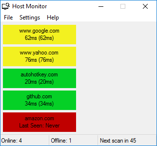
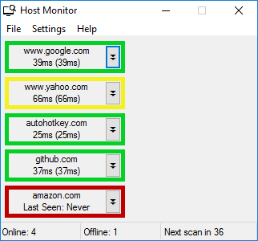
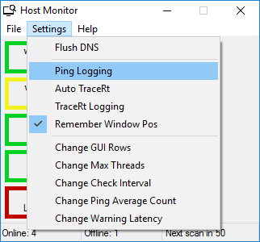
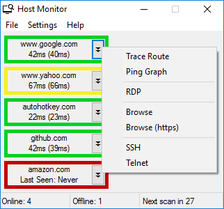

# Host-Monitor
A visual host monitoring script with tools for remote administration and troubleshooting.

## Compiling Instructions
To compile the script into an exe to use on any computer:  

1. Install the latest verion of AutoHotkey on the computer that will compile the script.  
   Download is available at https://autohotkey.com

2. Download the zip of this repository.

3. Extract the zip and Run the Build.ahk script.

4. Copy the resulting Host Monitor.exe file from the bin folder to the computer that needs to run the script.  
   This is the only file needed, as it contains all resources required, and will create the related files on first run.  
   The resulting exe does not require AutoHotkey to be installed on a computer to run.

5. Run Host Monitor.exe  
   This will create the folowing list of files:  
   -hosts.txt  
   -img\Green.jpg  
   -img\Red.jpg  
   -img\Yellow.jpg  
   -img\Host Monitor.ico  
   -inc\pingGraph.exe  
   -inc\pingMsg.exe  
   -inc\traceRt.exe  
   -inc\settings.xml  
   -inc\transform.xslt  
   -Logs\ (current timestamp).txt
